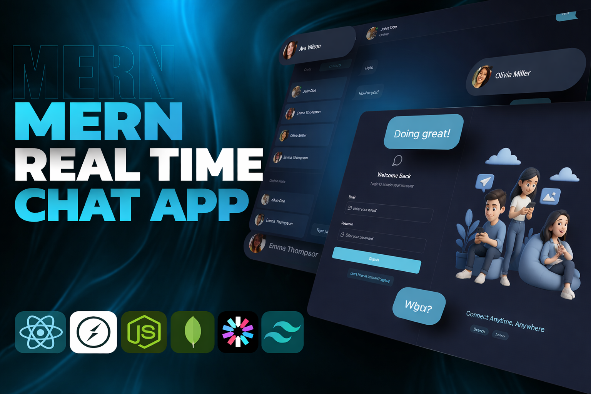

# ✨ Chatzy 💬 – Real-Time Messaging Platform ✨

[](https://chatzy-0u8l.onrender.com/)
[](https://github.com/anuj-singal/chatzy)


A modern **full-stack real-time chat application** built with the **MERN Stack**, powered by **WebSockets**, secure **JWT authentication**, and production-ready architecture.

Chatzy delivers seamless **real-time communication**, presence detection, media uploads, and secure user authentication — all deployed on the cloud.

---


<p align="center">
  
</p>

---


## 🌐 Live Demo

Live Project: [Chatzy on Render](https://chatzy-0u8l.onrender.com/)

> 

---

## 🚀 Features

- 🔐 Custom JWT Authentication (No third-party auth)
- ⚡ Real-Time Messaging with Socket.io
- 🟢 Online / Offline Presence Tracking
- 🔔 Notification & Typing Sounds (toggle supported)
- 📨 Automated Welcome Emails (Resend)
- 🗂️ Image Uploads & Cloud Storage (Cloudinary)
- 🚦 API Rate Limiting & Protection (Arcjet)
- 🎨 Modern UI with TailwindCSS + DaisyUI
- 🧠 Global State Management using Zustand
- ☁️ Production Deployment on Render

---

## 🏗️ Tech Stack

- **Frontend:** React, Vite, TailwindCSS, DaisyUI, Zustand
- **Backend:** Node.js, Express.js
- **Database:** MongoDB Atlas
- **Real-Time:** Socket.io
- **Authentication:** JWT + bcrypt
- **Media Storage:** Cloudinary
- **Email Service:** Resend
- **Security:** Arcjet Rate Limiting
- **Deployment:** Render (Free Tier)

---

## 📂 Project Structure

```
chatzy/
 ├── backend/
 │   ├── src/
 │   └── package.json
 ├── frontend/
 │   ├── src/
 │   └── package.json
 └── package.json (root build controller)
```

The root `package.json` handles installation and production build for both frontend and backend.

---

## ⚙️ Environment Variables

Create a `.env` file inside `/backend`:

```env
MONGO_URI=your_mongodb_uri
JWT_SECRET=your_secret_key

CLOUDINARY_CLOUD_NAME=
CLOUDINARY_API_KEY=
CLOUDINARY_API_SECRET=

RESEND_API_KEY=
ARCJET_KEY=

CLIENT_URL=http://localhost:5173
```

---

## 🛠️ Local Installation

### 1️⃣ Clone the repository

```bash
git clone https://github.com/anuj-singal/chatzy.git
cd chatzy
```

### 2️⃣ Install dependencies & build

```bash
npm run build
```

### 3️⃣ Run Backend (Development)

```bash
cd backend
npm run dev
```

### 4️⃣ Run Frontend (Development)

```bash
cd frontend
npm run dev
```

Open:  
👉 http://localhost:5173

---

## 🌍 Deployment

### Production Setup

- Backend + Frontend → Render
- Database → MongoDB Atlas
- Media Storage → Cloudinary
- Emails → Resend

---

## 📈 Why This Project Stands Out

- Custom authentication (no Firebase/Auth0 shortcuts)
- Real-time WebSocket implementation
- Production deployment with proper CORS handling
- Clean full-stack architecture
- SaaS-ready foundation

---

## 📜 License

MIT License
Copyright (c) 2026 Anuj Singal

---

## 👨‍💻 Author

[](https://github.com/anuj-singal)
[](https://www.linkedin.com/in/anujsingal/)

---

<p align="center">⭐ If you like this project, consider giving it a star on GitHub!</p>

